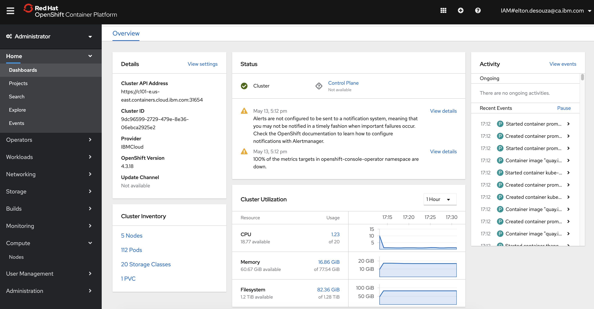
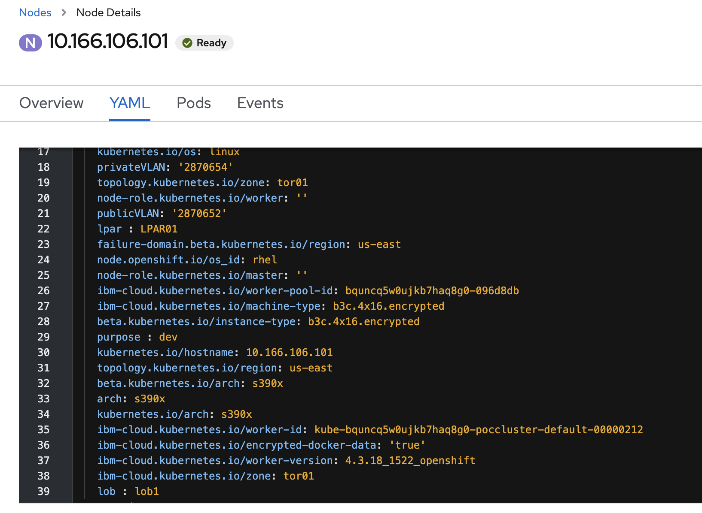
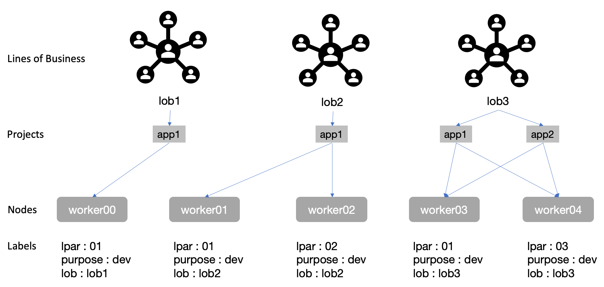
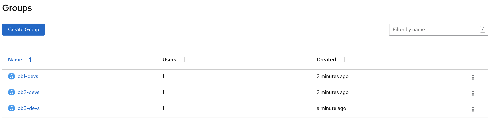

# Chargeback

Infrastructure groups within organizations generally group users under the Lines of Businesses they belong to for charge-back. Existing chargeback models are generally built on Virtual Machine (VM) usage pools where VM's are allocated to LoBs on-demand and usage is based on resource consumption over a period of time.

We will cover this in 4 sections:

- [Limiting LoBs to VMs](#limiting-lobs-to-vms)
  - [Topology](#topology)
  - [Node Labels](#node-labels)
  - [Mapping](#mapping)
  - [Projects](#projects)
  - [Groups](#groups)
  - [RBAC](#rbac)
  - [Testing](#testing)
  - [Admission controllers (optional)](#admission-controllers-optional)
  - [Resource Quotas (optional but recommended)](#resource-quotas-optional-but-recommended)
- [OpenShift Metering](#openshift-metering)
- [zVM Monitoring](#zvm-monitoring)
- [Combining metrics](#combining-metrics)

## Limiting LoBs to VMs

OpenShift deploys workloads into [Worker Nodes](https://docs.openshift.com/container-platform/4.3/nodes/nodes/nodes-nodes-viewing.html), where each node is VM. By default, the Kubernetes (k8s) scheduler will deploy workload ([pods](https://kubernetes.io/docs/concepts/workloads/pods/pod/)) across worker nodes based on resource utilization heuristics built into k8s. These heuristics provide optimal scheduling in general, but to align with existing organization policies, we need a way to limit pods to specific nodes.

k8s has a concept of [namespaces](https://kubernetes.io/docs/concepts/overview/working-with-objects/namespaces/) that provide resource isolation and a mechanism for book-keeping. It is important to note that the isolation provided is `logical` as a common misconception is that namespace offer **security** isolation but it does not as pods across namespaces can be deployed on the same VM and could be vulnerable to container escape vulnerabilities etc. Namespaces as-is don't offer isolation between LoBs that align with existing VM based chargeback metrics.

### Topology

- OpenShift 4.3
- 3 Masters named `master[0-2]` for simplicity
- 5 Workers named `woker[0-4]` for simplicity

This is our sample cluster deployed on IBM Cloud.

> RedHat OpenShift on IBM Cloud is abbreviated as ROKS. To learn how to deploy and manage OCP on IBM Cloud, please check [this](https://www.ibm.com/ca-en/cloud/openshift) link.



For mapping LoBs to VM's, we will need to use:

- [Node Labels](#node-labels)
- [Projects](#projects)
- [RBAC](#rbac)

### Node Labels

Labels allow users to map their organizational structures to in a loosely coupled fashion without requiring clients to store these mappings ([more info](https://kubernetes.io/docs/concepts/overview/working-with-objects/labels/#motivation)). For this scenario, we will apply labels to worker nodes. Naming convention and org structure decomposition is beyond the scope of this tutorial, but we will post another blog to help define node labels, namespace naming best practices and topologies for multi-tenancy.

For now, we have 5 nodes defined `worker[0-5]`. We can use the names as is, or assign more meaningful names to use later for node selection for LoBs or to help make physical locations more visible. e.g. we might want to define what LPAR, zVM instance or CPC a VM was deployed to. We can apply node labels from the GUI:



Here we added 3 node labels:

- purpose : dev
- lpar : LPAR01, LPAR02
- lob : lob1, lob2, lob3

> Labels must have singular values for each key so pick only one of each option when applying it to a node.

> The `beta.kubernetes.io/arch: amd64`, `kubernetes.io/arch: amd64` and `arch: amd64` are pre-existing labels. These are really important for multi-arch deployments, which will be a future article. Assume `arch: s390x`, `beta.kubernetes.io/arch: s390x`, `kubernetes.io/arch: s390x` for the remainder of this article - architecture is irrelevant as this article is valid for any architecture.

### Mapping

We will this mapping for LoB -> Projects -> Nodes



### Projects

Next, we create the 5 Projects in the diagram [above](#mapping):

- lob1-app1
- lob2-app1
- lob3-app1
- lob3-app2

Each LoB can own multiple apps and each app will typically have a Project. It is also possible to have a LoB as a Project, and apps as deployments within that LoB but it would offer less granular control. Having each app as a Project makes it easier to map resources to individual apps, which can be consolidated for an LoB.

 // FIXME

You could also use [Namespace](https://docs.openshift.com/container-platform/4.3/applications/projects/working-with-projects.html) to do this but Projects are just k8s namespaces with additional annotations that allow for easier multi-tenancy by:

- Having stricter validation than namespaces (i.e. you cannot annotate a project other than a handful of predefined keys meaning you can assert a privileged user or component set that data)
- Projects are actually indirectly created by the server by a request mechanism. Thus you do not need to give users the ability to create projects directly.
- A cluster admin can inject a template for project creation (so you can have a predefined way to set up projects across your cluster).
- The project list is a special endpoint that determines what projects you should be able to see. This is not possible to express via RBAC (i.e. list namespaces means you can see all namespaces). Note that all of this was built in the early days of Kubernetes, and thus may be less important now.

> Note: Creating Projects from CLI will allow us to pass in a node selector using the `--node-selector` argument. If we do this using the GUI, we'd need to modify the namespace (not Project, since its immutable) to apply a node-selector.

_Command Line:_
`oc new-project lob1-app1 --node-selector='lpar=LPAR01,purpose=dev,lob=lob1'` and repeat for all the Projects from our [Mapping](#mapping) diagram below. Ultimately, we will need 4 projects for `lob[0-1]-app[0-1]`.

_GUI:_
`Projects` are immutable so we need to change the namespace assigned to it (which is mutable):

1. Look for the namespace assigned to the Project (it will have the same name). e.g `lob1-app1`
2. Add `openshift.io/node-selector: 'lpar=01,vm-id=dev-vm-01'` in the YAML. It should look like this: . // FIXME

> We do not use Kubernetes Affinities since they do not give us the strict placement policies needed for accurate chargeback. Neither `requiredDuringSchedulingIgnoredDuringExecution` nor `preferredDuringSchedulingIgnoredDuringExecution` meet our criteria to **always** run a pod on specific node(s) throughout their lifetime.

### Groups

Next, create groups (or map from LDAP following [these instructions](https://docs.openshift.com/container-platform/4.3/authentication/ldap-syncing.html)):



### RBAC

We will need a Role (or ClusterRole) and RoleBinding (or ClusterBindings) to map groups to Projects/Namespaces.

> In this article we assume you understand basics of RBAC. If not, please read the official [k8s documentation on RBAC](https://kubernetes.io/docs/reference/access-authn-authz/rbac/)

```yaml
kind: ClusterRole
apiVersion: rbac.authorization.k8s.io/v1
metadata:
  name: developer
rules:
  - apiGroups: [""]
    resources: ["pods"]
    verbs: "*"
```

For this simple tutorial, we'll give the very permissive "\*". In production you'll need to use the principle of least privilege and build up from there. This will also need to be repeated for `lob2`, and `lob3` by changing the `metadata.namespace` field.

We could also create a Role vs a ClusterRole and limit to the lob1/lob2/lob3 namespace but using a ClusterRole allows us to define the permissions only once and then reference it from multiple RoleBindings for individual namespaces.

Next we setup a RoleBinding. This maps roles to objects and users/groups.

```yaml
apiVersion: rbac.authorization.k8s.io/v1beta1
kind: RoleBinding
metadata:
  name: developer-binding
  namespace: lob1-app1
roleRef:
  apiGroup: rbac.authorization.k8s.io
  kind: ClusterRole
  name: developer
subjects:
  - kind: Group
    name: "lob1-devs"
    apiGroup: rbac.authorization.k8s.io
```

You could also use serviceaccounts for automated devops pipelines etc:

```yaml
subjects:
  - kind: Group
    name: system:serviceaccounts:qa
    apiGroup: rbac.authorization.k8s.io
```

Repeat the RoleBinding for the other 3 namespaces.

We'll focus on user roles and not service accounts for this tutorial.

Users from each LoB will now have the ability to deploy pods only to the Projects their LoB has access to.

### Testing

RBAC has no default way to list which namespaces a user has access to, but we can write a simple script to do this:

```bash
for n in $(oc get ns -o jsonpath='{.items[*].metadata.name}'); do
  echo -n "$n: "
  oc auth can-i get pods -n "$n" --as=[your user name]
done
```

Lets try to deploy apps simulating users in each LoB:

//WIP

### Admission controllers (optional)

> Another mechanism to enforce node selections for namespaces is to use `Admission Controllers`. This is a bit of a sledgehammer, as there are easier, less operationally invasive ways to do this above, but we mention it here for completeness.

WIP

### Resource Quotas (optional but recommended)

WIP

## OpenShift Metering

WIP

## zVM Monitoring

WIP

## Combining metrics

WIP

In future we will cover how this can be done using RH Cost Management for clusters with internet connectivity:

</img>
